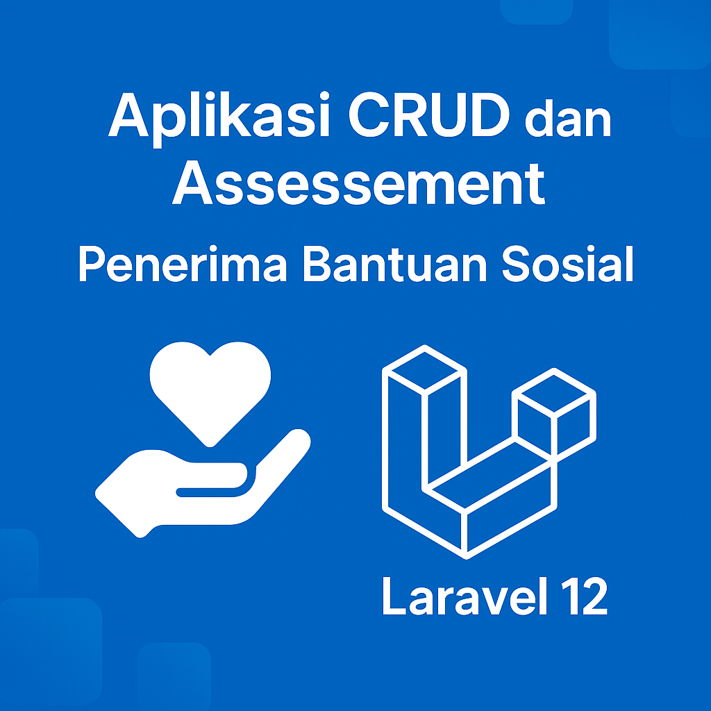

# 🎯 Aplikasi CRUD dan Assessment Penerima Bantuan Sosial

## 👤 Dibuat oleh: **Fuad Khasani (STI202202678)**

---

## 👋 Selamat Datang

Selamat datang di repositori **Aplikasi CRUD dan Assessment Penerima Bantuan Sosial**.  
Aplikasi ini dibangun dengan **Laravel 12** untuk membantu proses **pendataan penerima bantuan** dan **penilaian kelayakan secara otomatis**.  
Fitur filtering dan kategori kelayakan memudahkan analisis dan pengambilan keputusan.

---

## 🚀 Fitur Utama

- ✅ CRUD data penerima bantuan.
- ✅ Sistem penilaian kelayakan otomatis berdasarkan:
  - **Pendapatan Bulanan**
  - **Jumlah Tanggungan**
  - **Kondisi Rumah**
- ✅ Pengelompokan penerima berdasarkan kategori kelayakan:
  - `Sangat Layak`, `Layak`, `Kurang Layak`, `Tidak Layak`
- ✅ Filtering data sesuai kriteria.

---

## 📊 Logika Penilaian

| **Kriteria**       | **Poin**                                |
|--------------------|------------------------------------------|
| **Pendapatan**     | ≤1.000.000 = 40 1-2 juta = 20 >2 juta = 0 |
| **Jumlah Tanggungan** | ≥5 = 30 3-4 = 15 <3 = 0          |
| **Kondisi Rumah**  | Tidak Layak = 30 Kurang Layak = 15 Layak = 0 |

**Kategori Berdasarkan Skor Total:**
- 🎯 **80-100** → `Sangat Layak`
- ✅ **50-79** → `Layak`
- ⚠️ **20-49** → `Kurang Layak`
- ❌ **0-19** → `Tidak Layak`

---

## 🗄️ Skema Database

### 📦 **Tabel penerima_bantuan**
| Kolom          | Tipe          | Keterangan                  |
|----------------|---------------|-----------------------------|
| id             | BigInt (PK)   | Auto increment              |
| nik            | String(16)    | Unique, NIK                 |
| nama           | String(255)   | Nama penerima               |
| tanggal_lahir  | Date          |                             |
| jenis_kelamin  | Enum          | Laki-laki / Perempuan       |
| alamat         | Text          |                             |
| status_bantuan | Enum          | Aktif / Tidak Aktif         |
| created_at     | Timestamp     |                             |
| updated_at     | Timestamp     |                             |

### 📦 **Tabel assessment_penerima**
| Kolom               | Tipe            | Keterangan                        |
|---------------------|-----------------|------------------------------------|
| id                  | BigInt (PK)     | Auto increment                    |
| penerima_id         | Foreign Key     | Relasi ke tabel `penerima_bantuan`|
| pendapatan_bulanan  | Decimal(15,2)   |                                  |
| jumlah_tanggungan   | Integer         |                                  |
| kondisi_rumah       | Enum            | Layak, Kurang Layak, Tidak Layak |
| skor_kelayakan      | Integer         | 0 - 100                          |
| kategori_kelayakan  | Enum            | Sangat Layak, Layak, dst.        |
| catatan             | Text (nullable) |                                  |
| tanggal_penilaian   | Date            |                                  |
| created_at          | Timestamp       |                                  |
| updated_at          | Timestamp       |                                  |

**Relasi:**  
`penerima_bantuan (1)` 🔗→ `assessment_penerima (N)`

---

## 📁 Struktur Folder

\`\`\`plaintext
.
├── app
│   ├── Http
│   │   └── Controllers
│   │       ├── PenerimaBantuanController.php
│   │       └── AssessmentPenerimaController.php
│   └── Models
│       ├── PenerimaBantuan.php
│       └── AssessmentPenerima.php
├── database
│   └── migrations
├── public
├── resources
│   └── views
│       ├── penerima
│       │   ├── index.blade.php
│       │   ├── create.blade.php
│       │   ├── edit.blade.php
│       │   └── show.blade.php
│       └── assessment
│           └── create.blade.php
├── routes
│   └── web.php
├── .env
├── composer.json
└── package.json
\`\`\`

---

## 💻 Teknologi yang Digunakan

- 🚀 **Laravel 12**
- 💾 **MySQL**
- 🎨 **Blade + Bootstrap**
- 🧠 **PHP >= 8.2**
- 🔧 Node.js, NPM, Composer

---

## 🛠️ Cara Instalasi

1. Clone repositori ini:
   \`\`\`bash
   git clone https://github.com/username/nama-repo.git
   cd nama-repo
   \`\`\`
2. Install dependensi:
   \`\`\`bash
   composer install
   npm install && npm run build
   \`\`\`
3. Buat file konfigurasi:
   \`\`\`bash
   cp .env.example .env
   \`\`\`
4. Atur database di file .env.
5. Generate key:
   \`\`\`bash
   php artisan key:generate
   \`\`\`
6. Jalankan migrasi database:
   \`\`\`bash
   php artisan migrate
   \`\`\`
7. Jalankan aplikasi:
   \`\`\`bash
   php artisan serve
   \`\`\`

---

## 📷 Thumbnail Project

---

## 🤝 Kontribusi

Pull request, issue, dan saran sangat diterima! 😊

---

## 📝 Lisensi

MIT License - silakan gunakan dan kembangkan untuk kebutuhan pembelajaran maupun produksi.
